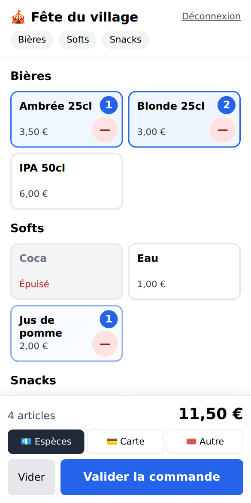
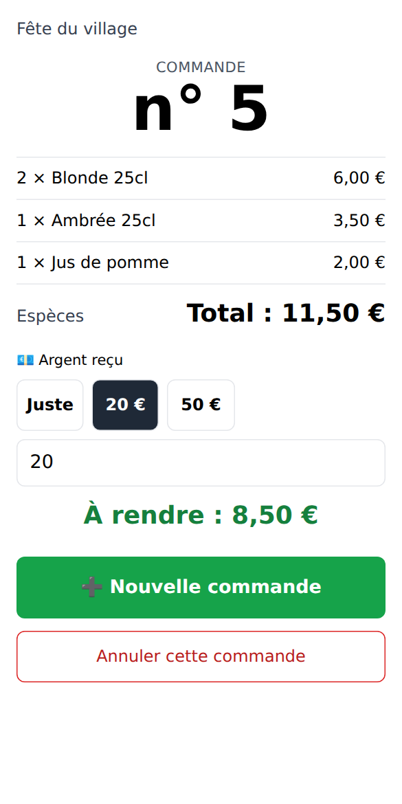
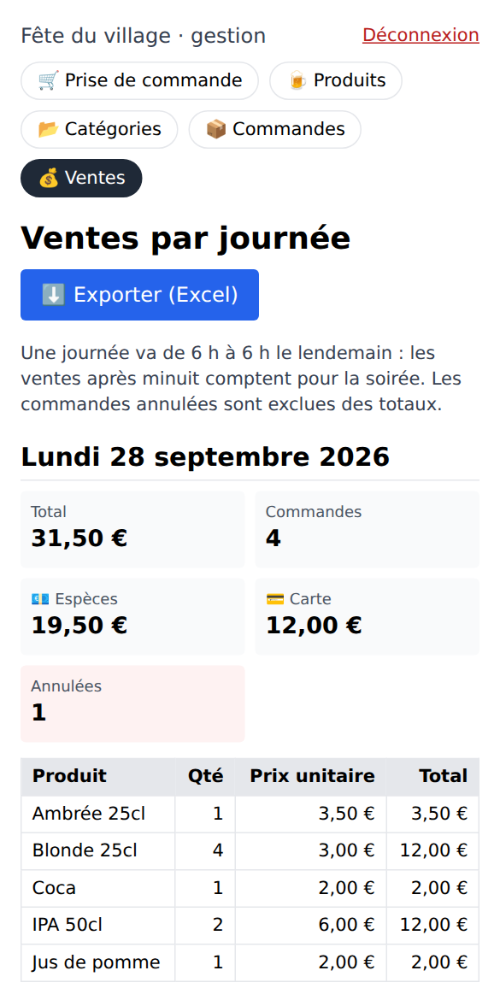

# 🍻 Festibar

**La prise de commande simple et rapide pour les buvettes de festivals et d’événements associatifs.**

Les bénévoles prennent les commandes sur leur téléphone, en quelques appuis, même quand le réseau sature.
Le gestionnaire prépare la carte, suit les ventes de la soirée et exporte tout dans un fichier Excel.
Une même installation peut accueillir plusieurs organisations (associations, comités des fêtes…), chacune avec ses propres produits, accès et ventes.

<p align="center">
  
  
  
</p>

---

## Sommaire

1. [Fonctionnalités](#-fonctionnalités)
2. [Démarrage rapide (production)](#-démarrage-rapide-production)
3. [Premier paramétrage](#-premier-paramétrage)
4. [Le jour de l’événement](#-le-jour-de-lévénement)
5. [Configuration](#-configuration)
6. [Exploitation : mises à jour, sauvegardes, restauration](#-exploitation)
7. [Développement](#-développement)
8. [Architecture](#-architecture)
9. [API](#-api)
10. [Sécurité](#-sécurité)
11. [Mentions légales et RGPD](#-mentions-légales-et-rgpd)
12. [Dépannage](#-dépannage)
13. [Limites connues et pistes d’amélioration](#-limites-connues-et-pistes-damélioration)
14. [Contribuer](#-contribuer) · [Licence](#-licence)

---

## ✨ Fonctionnalités

### Prise de commande (serveurs)

- **Grille de gros boutons** : un appui = un article, bouton « − » pour corriger, compteur sur chaque produit
- Raccourcis vers les catégories, produits **épuisés** grisés et non sélectionnables
- Barre de validation toujours visible : nombre d’articles, total, moyen de paiement (**espèces, carte, autre**)
- Panier conservé si la page se recharge, protection contre le double envoi
- **Récapitulatif** : numéro de commande en grand (à annoncer), boutons « Juste / 5 / 10 / 20 / 50 € » et **calcul du rendu de monnaie**
- **Mode hors-ligne** : sans réseau, la commande est gardée sur le téléphone puis envoyée automatiquement au retour de la connexion, sans doublon
- Carte rafraîchie toutes les 30 s (ruptures signalées par le gestionnaire), écran maintenu allumé pendant le service
- Annulation d’une commande par le serveur pendant 15 minutes (configurable)
- Rappel de l’interdiction de vente d’alcool aux mineurs

### Gestion (gestionnaire de l’organisation)

- **Produits** : ajout, modification, prix TTC, catégorie, bascule « en vente / épuisé » en un appui
- **Catégories** : création, renommage, ordre d’affichage par glisser-déposer ou flèches
- **Commandes** : historique par soirée, heure, moyen de paiement, annulation (conservée et tracée), retrait d’une ligne
- **Ventes** : total par soirée, par moyen de paiement et par produit, nombre de commandes et d’annulations
- **Export Excel** : toutes les commandes (statut, paiement, heure locale) + journal des annulations et suppressions
- **Remise à zéro** avant un nouvel événement : export proposé, puis confirmation en tapant l’identifiant de l’organisation

### Administration (administrateur de l’installation)

- Création, modification et suppression des organisations
- Mot de passe **gestionnaire** et mot de passe **serveurs** (optionnel) par organisation

### Général

- Application **installable** sur l’écran d’accueil du téléphone (PWA, en HTTPS)
- Interface en français, prix au format « 3,50 € », heures dans le fuseau de l’événement
- Ventes regroupées par **journée de service** : une vente à 1 h du matin compte pour la soirée de la veille
- Pages **Mentions légales**, **Confidentialité** et **CGU**
- Formulaire public « Demander un accès », avec notification par email

---

## 🚀 Démarrage rapide (production)

Festibar est livré sous forme d’**une seule image Docker** (API + interface compilée), servie en HTTPS par **Traefik**.

### Prérequis

- Un serveur avec **Docker** et **Docker Compose** (v2.24 ou plus récent)
- La **stack Traefik** démarrée sur ce serveur. Elle doit fournir :
  - le réseau Docker partagé `proxy`,
  - l’entrypoint `websecure` (port 443),
  - le resolver de certificats `letsencrypt`,
  - le middleware `security-headers@file`.
- Un **nom de domaine** (ex. `bar.exemple.fr`) dont l’enregistrement DNS pointe vers le serveur

### Installation

```bash
git clone https://github.com/jejedu22/festibar.git
cd festibar

# 1. Domaine de l'application (lu par Docker Compose)
cp .env.example .env
#    → éditer : FESTIBAR_HOST=bar.exemple.fr

# 2. Configuration de l'application
cp backend/.env.example backend/.env.local
#    → éditer au minimum JWT_SECRET (voir ci-dessous)

# 3. Construire l'image
docker compose build

# 4. Générer l'empreinte du mot de passe administrateur
docker run --rm festibar:latest node scripts/hash-password.js "un-mot-de-passe-solide"
#    → copier la ligne ADMIN_PASSWORD_HASH='…' dans backend/.env.local

# 5. Lancer
docker compose up -d
```

Générer `JWT_SECRET` :

```bash
openssl rand -hex 32
```

L’application est disponible sur `https://<FESTIBAR_HOST>`. Traefik obtient le certificat Let’s Encrypt automatiquement.

> **Reprendre une base existante** : copiez-la dans `./data/bar.db` avant le premier lancement. Elle est migrée automatiquement, sans perte de données.

### Ce que fait `docker-compose.yml`

| Élément | Rôle |
|---|---|
| Aucun port publié | L’application n’est joignable qu’à travers Traefik |
| Réseau `proxy` (externe) | Réseau partagé avec Traefik |
| `traefik.http.routers.festibar.rule=Host(...)` | Route le domaine `FESTIBAR_HOST` vers le conteneur |
| `entrypoints=websecure`, `tls.certresolver=letsencrypt` | HTTPS avec certificat Let’s Encrypt |
| `middlewares=security-headers@file` | En-têtes de sécurité communs de la stack Traefik |
| `loadbalancer.server.port=3001` | Port interne de l’application |
| `TRUST_PROXY=1`, `ENABLE_HSTS=true` | Vraie IP client (limitation des tentatives) et HSTS |
| Volume `./data:/app/data` | Base SQLite et sauvegardes persistées sur l’hôte |
| `env_file` | Charge `backend/.env` puis `backend/.env.local` s’ils existent |

> Si le resolver de votre stack Traefik ne s’appelle pas `letsencrypt`, adaptez le label `tls.certresolver`.
> Si votre middleware `security-headers` définit sa propre `Content-Security-Policy`, elle remplace celle de l’application et doit autoriser `style-src 'self' 'unsafe-inline'`.

---

## 🧭 Premier paramétrage

1. **Se connecter en administrateur** : `https://<domaine>/admin/auth/login`, avec le mot de passe dont vous avez généré l’empreinte.
2. **Créer une organisation** :
   - **Nom** : par exemple « Comité des fêtes ».
   - **Identifiant (slug)** : généré automatiquement, par exemple `comite-des-fetes`. Il forme l’adresse `https://<domaine>/comite-des-fetes`.
   - **Mot de passe gestionnaire** : accès complet, 8 caractères minimum.
   - **Mot de passe serveurs** : prise de commande uniquement, à partager avec les bénévoles.
3. **Se connecter en gestionnaire** : `https://<domaine>/<slug>/login` avec le mot de passe gestionnaire, puis **Gestion** :
   - créer les **catégories** (Bières, Softs, Snacks…) et les ordonner ;
   - créer les **produits** avec leur prix TTC.
4. **Distribuer l’accès aux serveurs** : l’adresse `https://<domaine>/<slug>` et le mot de passe serveurs.
   Sur chaque téléphone, ouvrir l’adresse puis **« Ajouter à l’écran d’accueil »** pour l’utiliser comme une application.

### Rôles

| Rôle | Où se connecter | Ce qu’il peut faire |
|---|---|---|
| **Administrateur** | `/admin/auth/login` | Gérer les organisations |
| **Gestionnaire** | `/<slug>/login` (mot de passe gestionnaire) | Tout pour son organisation : commandes, produits, catégories, ventes, export, remise à zéro |
| **Serveur** | `/<slug>/login` (mot de passe serveurs) | Prendre des commandes, annuler les siennes pendant 15 min |

---

## 🎪 Le jour de l’événement

**Avant l’ouverture**

- Vérifiez la carte et les prix, et testez une commande (puis annulez-la).
- Chargez l’application une fois sur chaque téléphone **avec du réseau** : la carte est alors gardée en mémoire pour le mode hors-ligne.
- Si des commandes de test ou d’un événement précédent existent : **Ventes → Exporter**, puis **Supprimer toutes les commandes**.

**Pendant le service**

- Produit en rupture : **Gestion → Produits → « En vente »** passe à « Épuisé ». Les téléphones sont à jour en moins de 30 s.
- Coupure réseau : un bandeau orange s’affiche. Les commandes continuent d’être saisies et partent seules au retour du réseau.
  Un bandeau jaune indique le nombre de commandes en attente d’envoi.
  Ne videz pas les données du navigateur et ne changez pas de téléphone tant qu’il reste des commandes en attente.
- Erreur de saisie : **Annuler cette commande** depuis le récapitulatif (15 min pour un serveur), ou depuis **Gestion → Commandes** pour le gestionnaire.
  Les annulations restent visibles et figurent dans l’export.

**Après la fermeture**

- **Ventes** : totaux de la soirée, par moyen de paiement, à comparer avec la caisse.
- **Exporter (Excel)** pour archiver. Un onglet « Journal » liste les annulations et les lignes retirées.

---

## ⚙️ Configuration

### Fichiers

| Fichier | Lu par | Contenu |
|---|---|---|
| `.env` (racine) | Docker Compose | `FESTIBAR_HOST` |
| `backend/.env.local` | l’application | Secrets et réglages (modèle : `backend/.env.example`) |

`.env`, `backend/.env` et `backend/.env.local` sont ignorés par git : ne les committez jamais.

### Variables de l’application (`backend/.env.local`)

**Sécurité**

| Variable | Défaut | Description |
|---|---|---|
| `JWT_SECRET` | *aléatoire au démarrage* | Secret de signature des sessions. **À définir** : sinon, toutes les sessions sont perdues à chaque redémarrage. |
| `ADMIN_PASSWORD_HASH` | — | Empreinte bcrypt du mot de passe administrateur (`scripts/hash-password.js`). Garder les apostrophes : `'$2b$12$…'` |
| `ADMIN_PASSWORD` | — | Ancien mot de passe en clair, accepté seulement si `ADMIN_PASSWORD_HASH` est vide (avertissement au démarrage) |
| `ADMIN_TOKEN_TTL` | `12h` | Durée d’une session administrateur |
| `ORG_TOKEN_TTL` | `24h` | Durée d’une session gestionnaire ou serveur |
| `STAFF_CANCEL_MINUTES` | `15` | Délai pendant lequel un serveur peut annuler une commande |
| `TRUST_PROXY` | *(vide)* ; `1` en Docker | Nombre de proxys devant l’application (Traefik = 1) |
| `ENABLE_HSTS` | `false` ; `true` en Docker | En-tête HSTS (uniquement si servi en HTTPS) |
| `ALLOWED_ORIGINS` | *(vide)* | Domaines autorisés à appeler l’API depuis un autre site (séparés par des virgules) |

**Événement et données**

| Variable | Défaut | Description |
|---|---|---|
| `APP_TIMEZONE` | `Europe/Paris` | Fuseau horaire de l’événement (affichage des heures, regroupement par journée) |
| `SERVICE_DAY_START_HOUR` | `6` | Heure de début d’une « journée de service » (avec `6`, les ventes jusqu’à 6 h comptent pour la veille) |
| `PORT` | `3001` | Port interne de l’application |
| `SQLITE_FILE` | `./bar.db` ; `/app/data/bar.db` en Docker | Emplacement de la base |
| `BACKUP_INTERVAL_MINUTES` | `60` | Fréquence des sauvegardes automatiques (`0` = désactivées) |
| `BACKUP_KEEP` | `48` | Nombre de sauvegardes conservées |
| `BACKUP_DIR` | `<dossier de la base>/backups` | Dossier des sauvegardes |
| `CONTACT_RETENTION_DAYS` | `365` | Conservation des demandes de contact (RGPD) |

**Email (formulaire « Demander un accès »)**

| Variable | Description |
|---|---|
| `ADMIN_EMAIL` | Destinataire des demandes. Sans lui, pas d’email, mais les demandes restent enregistrées en base. |
| `SMTP_HOST`, `SMTP_PORT`, `SMTP_SECURE`, `SMTP_USER`, `SMTP_PASS` | Serveur d’envoi (`SMTP_SECURE=true` pour le port 465, `false` pour 587) |
| `SMTP_FROM` | Adresse d’expédition. Obligatoire si `SMTP_USER` n’est pas une adresse email (Brevo, SendGrid…) ; sinon `SMTP_USER` est utilisé |

Pour vérifier la configuration, envoyez un email de test à `ADMIN_EMAIL` :

```bash
docker compose exec festibar node scripts/test-mail.js
```

Le script affiche la configuration lue, teste la connexion et l’authentification, puis envoie l’email ; en cas d’échec, il indique la cause probable (identifiants, port, pare-feu, expéditeur refusé). Au démarrage, les journaux indiquent aussi `📧 Emails activés` ou ce qui manque.

**Mentions légales** (affichées sur `/mentions-legales`, `/confidentialite`, `/cgu` ; « [à compléter] » si vide)

| Variable | Exemple |
|---|---|
| `LEGAL_EDITOR_NAME` | Comité des fêtes de Trifouillis |
| `LEGAL_EDITOR_STATUS` | Association loi 1901 |
| `LEGAL_EDITOR_ADDRESS` | 1 place de la Mairie, 22000 Ville |
| `LEGAL_EDITOR_REGISTRATION` | RNA W221234567 |
| `LEGAL_EDITOR_EMAIL`, `LEGAL_EDITOR_PHONE` | Contact de l’éditeur |
| `LEGAL_PUBLICATION_DIRECTOR` | Nom du directeur ou de la directrice de la publication |
| `LEGAL_PRIVACY_EMAIL` | Contact pour les données personnelles (par défaut : `LEGAL_EDITOR_EMAIL`) |
| `LEGAL_HOST_NAME`, `LEGAL_HOST_ADDRESS`, `LEGAL_HOST_PHONE` | Hébergeur du serveur |

---

## 🔧 Exploitation

### Commandes courantes

```bash
docker compose ps                 # état (le conteneur doit être « healthy »)
docker compose logs -f            # journaux de l'application
docker compose up -d              # appliquer une modification de backend/.env.local (recrée le conteneur)
docker compose restart            # simple redémarrage (ne relit PAS backend/.env.local)
docker compose down               # arrêter
```

### Mettre à jour

```bash
git pull
docker compose up -d --build
```

La base est migrée automatiquement au démarrage. Les utilisateurs devront peut-être se reconnecter.

### Sauvegardes

- **Automatiques** : toutes les heures dans `./data/backups/bar-AAAAMMJJ-HHMMSS.db`, 48 conservées. Elles sont faites à chaud et restent cohérentes.
- **Manuelle** (par exemple juste avant ou après un événement) :

  ```bash
  docker compose exec festibar node -e "require('./utils/backup').backup().then(f => { console.log(f); process.exit(0) })"
  ```

- **Hors du serveur** : copiez régulièrement `./data/backups/` ailleurs (rsync, stockage externe…). Une sauvegarde restée sur le même disque ne protège pas d’une panne de ce disque.

### Restaurer une sauvegarde

```bash
docker compose down
cp data/bar.db data/bar.db.avant-restauration                  # par précaution
rm -f data/bar.db-wal data/bar.db-shm
cp data/backups/bar-20260714-230000.db data/bar.db
docker compose up -d
```

### Repartir d’une base vide

```bash
docker compose down && mv data/bar.db data/bar.db.old && rm -f data/bar.db-wal data/bar.db-shm && docker compose up -d
```

---

## 🧑‍💻 Développement

### Avec Docker (rechargement à chaud)

```bash
cp backend/.env.example backend/.env.local     # ADMIN_PASSWORD=... suffit en local
docker compose -f docker-compose.dev.yml up
```

- Interface (Vite) : <http://localhost:8001>, les appels `/api` sont relayés vers le backend
- API (nodemon) : <http://localhost:3001>
- Base de développement : `./data/bar.db`

Ce mode n’utilise pas Traefik.

### Sans Docker

Prérequis : Node.js 20.19+ ou 22+.

```bash
npm install                                    # outils racine (concurrently)
cp backend/.env.example backend/.env.local
npm run dev                                    # backend :3001 + frontend :8001
```

### Structure du projet

```
.
├── backend/                     # API Express + SQLite
│   ├── app.js                   # Express : sécurité (helmet, CORS), routes, fichiers statiques
│   ├── index.js                 # Démarrage : base prête → sauvegardes → écoute
│   ├── config/
│   │   ├── auth.js              # Secrets, durées de session, règles de mots de passe
│   │   └── database.js          # Connexion SQLite, schéma et migrations automatiques
│   ├── controllers/             # Logique métier (commandes, produits, ventes, export…)
│   ├── middlewares/             # adminAuth, orgAuth (rôles), withOrganization (slug → id)
│   ├── routes/                  # Routes /api
│   ├── scripts/hash-password.js # Empreinte du mot de passe administrateur
│   ├── utils/                   # Sauvegardes, journal d'audit, fuseau horaire, limiteur…
│   └── public/                  # Frontend compilé (utilisé hors Docker)
├── frontend/                    # Application Vue 3
│   ├── public/                  # Manifest, icône, service worker (sw.js)
│   └── src/
│       ├── pages/               # Écrans (commande, récapitulatif, gestion, pages légales…)
│       ├── components/          # Navigation, notifications, boîte de confirmation…
│       ├── stores/              # Pinia : session d'organisation, interface
│       ├── utils/               # Client API, file hors-ligne, formatage…
│       └── router.js            # Routes et contrôle d'accès par rôle
├── docs/screenshots/            # Captures du README
├── data/                        # Base et sauvegardes (créé au lancement, ignoré par git)
├── Dockerfile                   # Image de production multi-étapes
├── docker-compose.yml           # Production derrière Traefik
├── docker-compose.dev.yml       # Développement
└── .env.example                 # FESTIBAR_HOST pour docker-compose.yml
```

### Compiler le frontend hors Docker

L’image Docker compile le frontend elle-même. Pour un déploiement sans Docker, régénérez `backend/public` :

```bash
cd frontend && npm run build && rm -rf ../backend/public && cp -r dist ../backend/public
```

### Tester

Il n’y a pas encore de tests automatisés. Avant une modification, vérifiez au minimum :
- que le frontend compile (`cd frontend && npm run build`) ;
- le parcours complet : connexion serveur, commande, récapitulatif, annulation, puis ventes et export côté gestionnaire ;
- le mode hors-ligne : dans les outils de développement du navigateur, réseau « Offline », passer une commande, repasser en ligne.

---

## 🏗 Architecture

```
 Téléphones / navigateurs
           │ HTTPS
           ▼
 ┌────────────────────┐   réseau « proxy »   ┌────────────────────────────────────────┐
 │      Traefik       │ ───────────────────▶ │ festibar (Node.js / Express, :3001)    │
 │ TLS Let's Encrypt  │                      │  ├─ /api/…   API JSON (JWT)            │
 └────────────────────┘                      │  └─ /…       interface Vue compilée    │
                                             │             │                          │
                                             │             ▼                          │
                                             │  SQLite ./data/bar.db (+ backups/)     │
                                             └────────────────────────────────────────┘
```

- **Frontend** : Vue 3, Vue Router, Pinia, Tailwind CSS, compilé par Vite. Le service worker met en cache l’interface. La carte et les commandes en attente sont stockées dans le `localStorage` du téléphone.
- **Backend** : Express 5, helmet, jsonwebtoken, bcrypt, exceljs, nodemailer.
- **Base** : SQLite en mode WAL, une seule instance de l’application.

### Modèle de données

| Table | Contenu |
|---|---|
| `organizations` | Nom, slug, empreintes des mots de passe gestionnaire et serveurs |
| `categories` | Catégories d’une organisation et leur ordre (`sort_order`) |
| `products` | Nom, prix TTC, catégorie, disponibilité |
| `orders` | Total, heure (UTC), statut `active` / `cancelled`, moyen de paiement, `client_id` (anti-doublon hors-ligne) |
| `order_items` | Lignes de commande (produit, quantité, prix au moment de la vente) |
| `audit_log` | Annulations, lignes retirées, remises à zéro (qui, quand, quoi) |
| `contacts` | Demandes d’accès (purgées après `CONTACT_RETENTION_DAYS`) |

Les heures sont stockées en UTC et converties dans le fuseau `APP_TIMEZONE` à l’affichage et à l’export.

---

## 🔌 API

Toutes les routes sont préfixées par `/api`. Les réponses sont en JSON, et les erreurs prennent la forme `{ "error": "message" }`.
Les routes protégées attendent l’en-tête `Authorization: Bearer <jeton>`.

| Méthode | Route | Accès | Description |
|---|---|---|---|
| POST | `/admin/auth/login` | public | Connexion administrateur → `{ token }` |
| GET | `/admin/organizations` | admin | Liste des organisations |
| POST | `/admin/organizations` | admin | Créer (`name`, `slug`, `password`, `staff_password?`) |
| PUT | `/admin/organizations/:id` | admin | Modifier (mots de passe optionnels, `remove_staff_password`) |
| DELETE | `/admin/organizations/:id` | admin | Supprimer (si aucune commande ni aucun produit) |
| GET | `/organizations/:slug` | public | Nom de l’organisation |
| POST | `/:slug/login` | public | Connexion → `{ token, role, id, name, slug }` |
| GET | `/:slug/products` | public | Carte |
| POST | `/:slug/products` | gestionnaire | Créer un produit |
| PUT | `/:slug/products/:id` | gestionnaire | Modifier un produit |
| PATCH | `/:slug/products/:id/availability` | gestionnaire | `{ available: true/false }` |
| DELETE | `/:slug/products/:id` | gestionnaire | Supprimer (refusé si déjà vendu) |
| GET | `/:slug/categories` | public | Catégories ordonnées |
| POST · PUT · DELETE | `/:slug/categories[/:id]` | gestionnaire | Créer, renommer, supprimer |
| PUT | `/:slug/categories/order` | gestionnaire | `{ order: [{ id, sort_order }] }` |
| POST | `/:slug/orders` | serveur, gestionnaire | `{ items: [{ productId, quantity }], paymentMethod, clientId? }` |
| GET | `/:slug/orders/:id` | serveur, gestionnaire | Détail d’une commande |
| DELETE | `/:slug/orders/:id` | serveur (15 min), gestionnaire | Annuler (statut `cancelled`) |
| GET | `/:slug/orders/all` | gestionnaire | Commandes groupées par journée de service |
| DELETE | `/:slug/orders/:orderId/items/:productId` | gestionnaire | Retirer une ligne (tracé) |
| DELETE | `/:slug/orders` | gestionnaire | Tout supprimer : `{ confirm: "<slug>" }` |
| GET | `/:slug/summary/today` · `/daily` | gestionnaire | Ventes du jour / par journée |
| GET | `/:slug/summary/daily/export` | gestionnaire | Fichier Excel |
| POST | `/contact` | public | Demande d’accès (`name`, `email`, `message`) |
| GET | `/legal` · `/config` | public | Informations légales / réglages d’affichage |

---

## 🔐 Sécurité

- **Mots de passe** : jamais stockés en clair (bcrypt). 8 caractères minimum pour les organisations, gestionnaire et serveurs différents.
- **Sessions** : jetons signés (JWT), limités à une organisation et à un rôle, avec expiration.
- **Limitation des tentatives** :
  - connexion administrateur : 5 échecs par IP sur 15 min ;
  - connexion d’organisation : 10 échecs sur 15 min ;
  - formulaire de contact : 3 demandes par heure, avec un champ piège anti-robots.
- **Validation côté serveur** : quantités entières de 1 à 99, produits existants et disponibles, prix toujours lus en base.
- **Traçabilité** : les commandes annulées sont conservées, et les annulations, retraits de ligne et remises à zéro sont inscrits dans un journal.
- **En-têtes** : helmet (Content-Security-Policy, X-Frame-Options…), HSTS en production. CORS fermé par défaut, messages d’erreur sans détail technique.
- **Bonnes pratiques d’exploitation** :
  - un `JWT_SECRET` long et secret ;
  - changer les mots de passe entre deux saisons ;
  - ne jamais committer les fichiers `.env*`.

Une faille ? Merci de la signaler en privé au mainteneur plutôt que dans une issue publique.

---

## ⚖️ Mentions légales et RGPD

L’application fournit les pages **Mentions légales** (`/mentions-legales`), **Confidentialité** (`/confidentialite`) et **CGU** (`/cgu`), accessibles en bas des pages publiques.
Renseignez les variables `LEGAL_*` (voir [Configuration](#-configuration)).

- **Données personnelles** :
  - seules les demandes d’accès (nom, email, message) en contiennent, et elles sont supprimées automatiquement ;
  - les commandes ne contiennent aucune donnée sur les clients de la buvette ;
  - aucun cookie publicitaire ni outil de mesure d’audience : le stockage local du navigateur sert uniquement au fonctionnement, sans consentement nécessaire.
- **Festibar n’est pas un logiciel de caisse certifié** (article 286, I-3° bis du Code général des impôts). Une organisation assujettie à la TVA qui enregistre des paiements doit utiliser un système de caisse certifié.
- **Débits de boissons temporaires** : ces obligations sont à la charge de l’organisation.
  - autorisation municipale d’ouverture de la buvette ;
  - affichage de l’interdiction de vente d’alcool aux mineurs ;
  - affichage des prix TTC.
- **Accessibilité** : si l’application est exploitée par un organisme public, une déclaration d’accessibilité (RGAA) est obligatoire.

Ces textes sont une base de travail et ne remplacent pas l’avis d’un juriste.

---

## 🩺 Dépannage

| Symptôme | Cause probable / solution |
|---|---|
| `required variable FESTIBAR_HOST is missing` | Créer `.env` à la racine (`cp .env.example .env`) et renseigner le domaine |
| `network proxy declared as external, but could not be found` | La stack Traefik n’est pas démarrée (c’est elle qui crée le réseau `proxy`) |
| 404 de Traefik sur le domaine | Vérifier `FESTIBAR_HOST`, `docker compose ps` (conteneur `healthy`), et que Traefik voit le conteneur (`exposedByDefault` / label `traefik.enable`) |
| Certificat invalide ou autosigné | DNS pas encore propagé, ports 80/443 fermés, ou resolver nommé autrement que `letsencrypt` (voir les logs de Traefik) |
| Page blanche ou styles cassés derrière Traefik | La CSP du middleware `security-headers` remplace celle de l’application : autoriser `style-src 'self' 'unsafe-inline'` |
| Connexion administrateur : « Mot de passe incorrect » alors qu’il est bon, ou « non configurée » | L’empreinte a été tronquée par Docker Compose : dans `backend/.env.local`, elle doit être **entre apostrophes** (`ADMIN_PASSWORD_HASH='$2b$12$…'`), pas entre guillemets ni sans rien. Le journal (`docker compose logs festibar`) affiche « ADMIN_PASSWORD_HASH invalide » dans ce cas. Corriger puis `docker compose up -d` (un simple `restart` ne relit pas le fichier). |
| Tout le monde est déconnecté après un redémarrage | `JWT_SECRET` non défini (un secret temporaire est généré à chaque démarrage) |
| « Trop de tentatives » | Attendre 15 minutes. Si tous les utilisateurs sont bloqués ensemble, vérifier `TRUST_PROXY=1` (sinon, tous semblent venir de l’IP de Traefik) |
| Heures décalées ou ventes après minuit sur le mauvais jour | Vérifier `APP_TIMEZONE` et `SERVICE_DAY_START_HOUR` |
| Pas d’email pour les demandes d’accès | Lancer `docker compose exec festibar node scripts/test-mail.js` : il indique ce qui bloque. Vérifier aussi les indésirables. Les journaux affichent `📧 … envoyée par email` ou `❌ Erreur envoi mail` à chaque demande ; les demandes restent enregistrées en base. |
| Commandes « en attente d’envoi » qui ne partent pas | Le téléphone n’a pas de réseau, ou la session a expiré : se reconnecter sur ce même téléphone |
| « Commande(s) hors-ligne refusée(s) » | Un produit a été supprimé entre-temps. Le gestionnaire doit ressaisir la commande. |
| L’application ne s’installe pas sur le téléphone | L’installation et le rechargement sans réseau nécessitent le HTTPS |

---

## 📌 Limites connues et pistes d’amélioration

- **Limites actuelles** :
  - une seule instance de l’application (SQLite) : suffisant pour une buvette, pas pour de très gros volumes ;
  - montants stockés en nombres à virgule, arrondis au centime ; un stockage en centimes serait plus robuste ;
  - le mode hors-ligne nécessite d’avoir chargé l’application une fois avec du réseau.
- **Pistes d’amélioration** :
  - impression de tickets ;
  - gestion de stock en quantités et alertes de rupture ;
  - plusieurs événements par organisation ;
  - tests automatisés ;
  - internationalisation.

---

## 🤝 Contribuer

1. Forker le projet
2. Créer une branche : `git checkout -b feature/ma-fonctionnalite`
3. Committer : `git commit -m "Ajout de ma fonctionnalité"`
4. Pousser : `git push origin feature/ma-fonctionnalite`
5. Ouvrir une Pull Request en décrivant le changement et la façon dont il a été testé

Merci pour vos contributions ! 🎉

---

## 📜 Licence

Ce projet est open-source et libre de droit pour usage personnel ou en festival. 🍻
